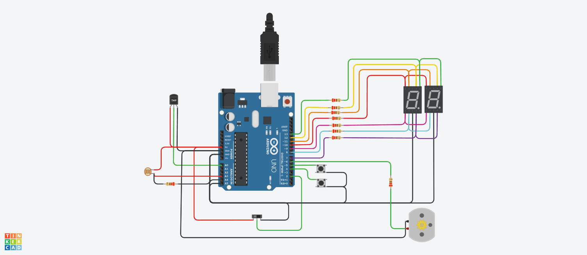

# PROYECTO-SPD

## Integrantes 
- Clara Cuenca
- Santiago Ambricca
- Jorge Moyano
- Dylan Galeano

## Primera parte - Contador de 0 a 99 con Display 7 Segmentos y Multiplexación.

## Descripción
Utilizando la técnica de multiplexación, se muestran los números del 0 al 99 mediante dos displays de 7 segmentos. Al presionar los botones, el contador aumentará, disminuirá o se reiniciará, respectivamente.

## :robot: Link a la primera parte
https://www.tinkercad.com/things/h7tS8dfDWvt?sharecode=M_-4ScPXRaZu-yy-105vIUKHCRaY0bu3v02LwuJ2FPU

## Segunda parte - Modificación con Interruptor Deslizante y Números Primos.

## Descripción
Se reemplazó el botón reiniciar por un interruptor deslizante. Dependiendo de la posición del interruptor, los displays mostraran todos los números (como en la primera parte), o sólo los números primos.
Además, se agregaron un motor de cc y un sensor de temperatura. Si el sensor detecta una temperatura muy elevada, automaticamente se apagarán los displays y el motor. 
En esta ocasión, el motor no tiene una utilidad real en el proyecto, es solo demostrativo.

## :robot: Link a la segunda parte
https://www.tinkercad.com/things/hQJ2FbbTdeM?sharecode=k_4B6cy1MBkjQ8rDKuGfSpQG3RdgZ2tCy8VJqfTiFzk

## Tercera parte - Implementando una fotoresistencia

## Descripción
Se añadió una fotoresistencia a la segunda parte del proyecto.
La fotoresistencia detecta la intensidad de la luz que el arduino recibe. En base a esta intensidad, se modificara el brillo de los displays.

## :robot: Link a la tercera parte
https://www.tinkercad.com/things/ah6izHFt7Qk?sharecode=Q5CEUSWxt1ublBDTk703Kj9ALq5wnlrfiPtFN0p1FRI
